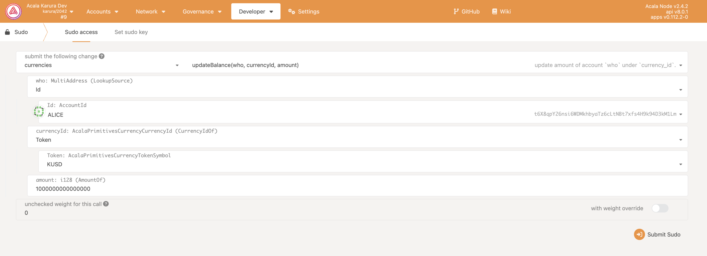
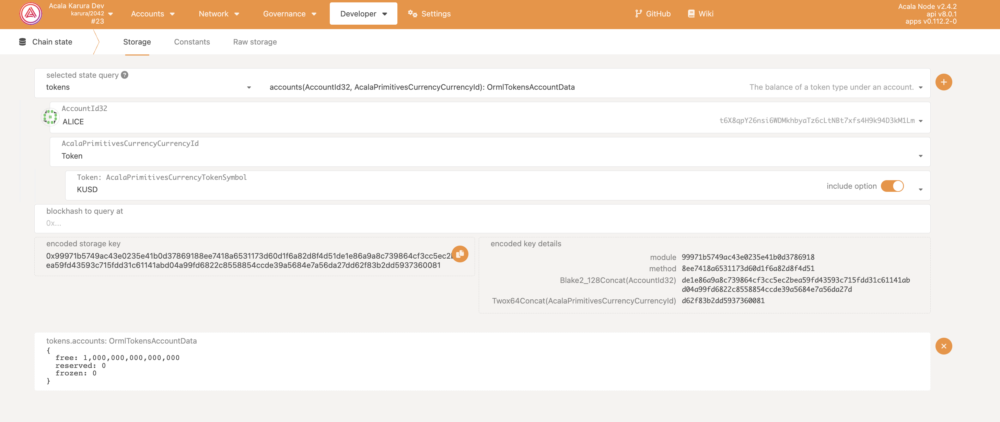
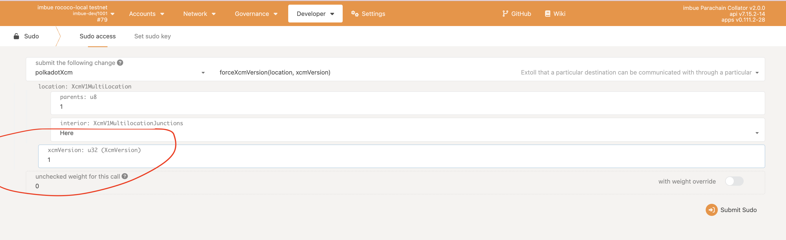
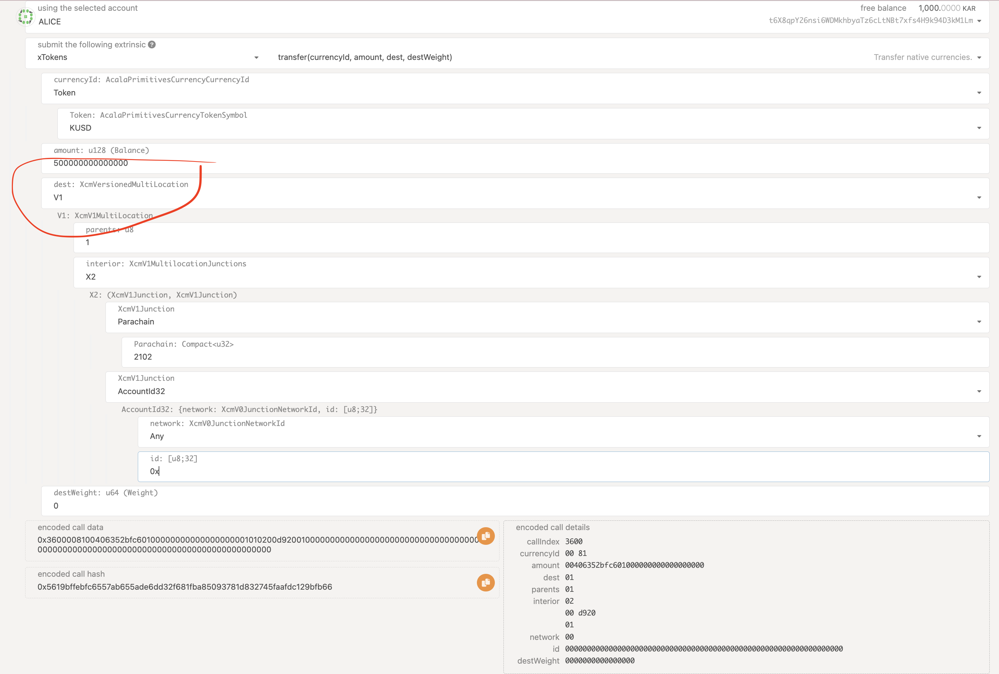
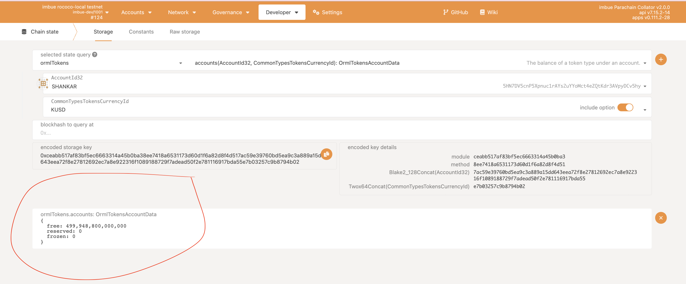

<a href="https://github.com/w3f/Grants-Program/pull/703"></a>
Imbue Network is a decentralised crowdfunding DAO built on top of the Polkadot blockchain platform. It is an idea incubator open to the entire world that allows anyone, from any walk of life and for any kind of endeavour, to submit and vote on Ideas worth funding from the communities that believe in them the most.

# Imbue Collator

This documentation will cover the below explanation
1) Launching the network: Will explain how you can launch the network locally using the docker configuration with as simple as one step
2) Going through our proposal pallet (our core pallet), explaining the usage step by step

## 1) Launching the network locally - Using Docker (Automated)

The default compose file automatically launches a local network containing multiple relaychain validators (polkadot nodes) and collators (Imbue collators) which you can interact with using the [browser-based polkadotjs wallet](https://polkadot.js.org/apps/#/explorer). Additionally, docker can be used to launch a collator to supported testnets.
Follow these steps to prepare a local development environment :hammer_and_wrench:

### Setup

1) You will need to [install docker](https://www.docker.com/products/docker-desktop) to launch our pre-built containers
2) Checkout the repository
```bash
git clone --recursive https://github.com/ImbueNetwork/imbue.git

cd imbue
```

#### Run the tests

```bash
cargo test
```

### Run

Launch a local network using docker compose:

```bash
docker-compose -f scripts/docker-compose.yml up -d
```

The `scripts` directory contains the docker-compose file which is used to launch the network using a single command. Launching with docker ensures parachains are registered to the relaychain automatically and will begin authoring blocks shortly after launch.  

To ensure your network is functioning properly:  
1) Confirm docker containers are running
```bash
docker ps
``````
- These container names should have a status of 'up':
    - frontend 
    - launch
 
2) Check the container logs
```bash 
docker logs launch
```
- If the network was launched successfully, you will see something similar to this:

```bash 
docker logs frontend
```
- If successful, ```Accepting connections at http://localhost:3001``` will be displayed in the terminal.


## 2) Launching the network locally from source - Manually
You can manually launch a relaychain and parachain then register the parachain directly from the source code

### Prerequisite for both approaches

- First, setup your [Rust development environment](https://substrate.dev/docs/en/knowledgebase/getting-started). Then,

- Checkout the imbue and polkadot repositories and build the respective binaries:

  - imbue

    ```bash
    git clone --recursive https://github.com/ImbueNetwork/imbue.git
    cd imbue
    git submodule update --recursive --remote

    cargo build --release
    ```

  - polkadot

    ```bash
    git clone https://github.com/paritytech/polkadot.git

    cd polkadot
    cargo build --release
    
    
    If the prerequisites have been completed and we have our binaries as shown [above](#prerequisite-for-both-approaches), follow the steps below to launch the network.


#### Create local chain spec

```bash
# Generate westend-local spec file
./target/release/polkadot build-spec --chain westend-local --raw --disable-default-bootnode > westend-local.json
```

#### Start relay chain validators

```bash
# Start Alice
./target/release/polkadot --alice --validator --base-path cumulus_relay/alice --chain rococo-local.json --port 30444 --ws-port 9944

# Start Bob
./target/release/polkadot --bob --validator --base-path cumulus_relay/bob --chain rococo-local.json --port 30555 --ws-port 9955

# Start Charlie
./target/release/polkadot --charlie --validator --base-path cumulus_relay/bob --chain rococo-local.json --port 30666 --ws-port 9966

# Start Dave
./target/release/polkadot --dave --validator --base-path cumulus_relay/bob --chain rococo-local.json --port 30777 --ws-port 9977
```
#### Create genesis & WASM files

```bash
cd imbue-collator

# Genesis
./target/release/imbue-collator export-genesis-state --parachain-id 2000 > para-2000-genesis-local

# WASM
./target/release/imbue-collator export-genesis-wasm > para-wasm-local
```

#### Start a collator

```bash
# Customize the --chain flag for the path to your 'rococo-local.json' file
./target/release/kylin-collator --alice --collator --force-authoring --parachain-id 2000 --base-path cumulus_relay/kylin-collator --port 40333 --ws-port 8844 -- --execution wasm --chain <path to 'rococo-local.json' file> --port 30343 --ws-port 9942

./target/release/kylin-collator --alice --collator --force-authoring --parachain-id 2013 --base-path cumulus_relay/kylin-collator --port 40334 --ws-port 8845 -- --execution wasm --chain <path to 'rococo-local.json' file> --port 30344 --ws-port 9943

```

- You should see your collator running and peering with the already running relay chain validators.  
- Your parachain will not begin authoring blocks until you have registered it on the relay chain.


### Interacting with your network

To connect to your local network's user interface, visit [polkadot.js](http://localhost:3001/#/explorer) on port 3001. Interacting with your network is detailed [below](#proposal-pallet-interaction)


**NOTE:** If you launched your network using docker or polkadot-launch, your parachains should be automatically registered to the relaychain and you can skip the below two steps and can continue [here](#proposal-pallet-interaction).
   
#### Validate the parachain is registered

1. Verify parathread is registered
   - On custom endpoint 9944, select `Network` -> `Parachains`
   - On the parathreads tab you should see your paraid with a lifecycle status of `Onboarding`
   - After onboarding is complete you will see your parachain registered on the Overview tab
2. Verify parachain is producing blocks
   - Navigate to the collator's custom endpoint 9942
   - Select `Network` -> `Explorer`
   - New blocks are being created if the value of `best` and `finalized` are incrementing higher

## Proposal Pallet interaction

Our proposal pallet consists of our core logic and facilitates the implementation through extrinsics (extrinsics can be thought of functions that can be called from outside, in this case from the frontend). 

The crowdfunding of a project basically comprises of 6 steps from the submission of the proposal to withdrawing of the fund. Alternatively, the individual or team can decide to withdraw their projects proposal as well. 
The flow of creating a proposal and getting funded is shown below step by step using screenshots. You can follow along the same either using polkadotjs apps or the frontend (localhost:3001) that comes with our docker compose

1) Creating a project: The first step is to create the project, i.e. submitting the proposal, the given signature of the extrinsic is shown below. From the UI select the pallet which is our imbueProposals pallet and then select the function below.

  ```javascript
  create_project(origin: OriginFor<T>, name: Vec<u8>, logo: Vec<u8>, description: Vec<u8>, website: Vec<u8>, proposed_milestones: Vec<ProposedMilestone>, required_funds: BalanceOf<T>)
  ```

  To create a project we need to pass the following parameters
  
    - Origin: This is the account trying to call the extrinsic
    - name: Name of the project you want to submit the proposal for
    - logo: logo for the project
    - description: description of the project 
    - website: provide the website of your project
    - proposed_milestones: its list of milestones you want to add with each milestone having name and percentage allocated to it
    - requiredFunds: amount requested for funding

please find the screenshot attached for the extrinsic call
   
  
2) Scheduling the round: Once the proposal for the project is submitted, the next step is to schedule the round for milestones.From the UI select the our imbueProposals pallet and then select the function below.

    ```javascript
    schedule_round(origin: OriginFor<T>, start: T::BlockNumber, end: T::BlockNumber, project_key: ProjectIndex, milestone_indexes: Vec<MilestoneIndex>)
    ```
   
  To schedule a round for milestone/s we need to pass the following parameters to the extrinsics

    - Origin: This is the account trying to call the extrinsic
    - start : We need to pass the block number from when the round is valid and make sure it should be greater than the current block 
    - end: We need to pass the blocknumber till when the round should be valid for the given milestone/s. This number should be greater than both start number and the current block.
    - project_key: This is basically a unique key that act as your project index
    - milestone_indexes: The milestones need to be included in the round

  please find the screenshot attached for the extrinsic call
   

3) Contributing to the project: Using this extrinsic, the community can contribute to the proposals they think have good potential.From the UI select the our imbueProposals pallet and then select the function below.  
   
  ```javascript
  contribute(origin: OriginFor<T>, project_key: ProjectIndex, value: BalanceOf<T>)
  ```

  To contribute to the proposal we need to pass the following parameters to the extrinsics

    - Origin: This is the account trying to call the extrinsic
    - project_key: unique key that act as your project index
    - value: the value they want to contribute to the proposal

  please find the screenshot attached for the extrinsic call
   
 

4) Vote on a specific milestone: This extrinsic allows community members to vote for specific milestone for a given proposal. They can either approve or disapprove by passing yes or no. From the UI select the our imbueProposals pallet and then select the function below. 

 ```javascript
  vote_on_milestone(origin: OriginFor<T>, project_key: ProjectIndex, milestone_index: MilestoneIndex, approve_milestone: bool)
  ```

  To vote on a milestone we need to pass the following parameters to the extrinsic

    - Origin: This is the account trying to call the extrinsic
    - project_key: unique key that act as your project index
    - milestone_indexe: The milestone which you want to vote for
    - approve_milestone: either yes or no

  please find the screenshot attached for the extrinsic call
   

 5) Approve the project proposal: This extrinsic is called to approve a project proposal with the milestones that is being approved. From the UI select the our imbueProposals pallet and then select the function below. 

  ```javascript
   approve(origin: OriginFor<T>, round_index: RoundIndex, project_key: ProjectIndex, milestone_indexes:  Vec<MilestoneIndex>)
  ```
    
  To approve a project we need to pass the following parameters

    - Origin: This is the account trying to call the extrinsic
    - RoundIndex: the scheduled round's index
    - project_key: unique key that act as your project index
    - milestone_indexes: The list of milestones which you want to approve
  
  please find the screenshot attached for the extrinsic call
   


## Contributing with Stable(kUSD) for a project

This guide will show you step by step process to transfer the kusd from acala to our imbue chain via xcm and use that to contribute to a project. 

### Launch your relaychain(polkadot) and the parachains(acala and imbue) as shown below

#### Build your binaries

- Checkout the imbue, acala and polkadot repositories and build the respective binaries:

  - imbue

    ```bash
    git clone --recursive https://github.com/ImbueNetwork/imbue.git
    cd imbue

    cargo build --release
    ```

  - polkadot

    ```bash
    git clone https://github.com/paritytech/polkadot.git

    cd polkadot
    cargo build --release
    ```

  - acala
  
      ```bash
    git clone https://github.com/AcalaNetwork/Acala.git

    cd Acala
      ```
    Follow their readme file to build and get binary

#### Clone polkadot-launch repo

      ```bash
        git clone https://github.com/paritytech/polkadot-launch.git
        cd polkadot-launch
        yarn 
      ```

#### Update the config.json file 

  - For this tutorial, i have used polkadot-launch to launch the relaychain and parachains. Update the config.json file inside the polkadot launch as shown below 

      ```javascript

      {
    "relaychain": {
      "bin": "./polkadot",
      "chain": "rococo-local",
      "nodes": [
        {
          "name": "alice",
          "wsPort": 9944,
          "port": 30444
        },
        {
          "name": "bob",
          "wsPort": 9955,
          "port": 30555
        },
        {
          "name": "charlie",
          "wsPort": 9966,
          "port": 30666
        },
        {
          "name": "dave",
          "wsPort": 9977,
          "port": 30777
        }
      ],
      "genesis": {
        "runtime": {
          "runtime_genesis_config": {
            "configuration": {
              "config": {
                "validation_upgrade_frequency": 1,
                "validation_upgrade_delay": 10
              }
            }
          }
        }
      }
    },
    "parachains": [
      {
        "bin": "./acala",
        "id": "2000",
        "chain": "karura-dev",
        "nodes": [
          {
            "wsPort": 9988,
            "port": 31200,
            "name": "alice",
            "flags": [
              "--unsafe-ws-external",
              "--unsafe-rpc-external",
              "--rpc-external",
              "--ws-external",
              "--rpc-cors=all",
              "--rpc-methods=Unsafe",
              "--log=xcm=trace",
              "--",
              "--execution=wasm"
            ]
          }
        ]
      },
      {
        "bin": "./imbue",
        "id": "2102",
        "nodes": [
          {
            "wsPort": 9942,
            "port": 31300,
            "name": "alice",
            "flags": [
              "--unsafe-ws-external",
              "--unsafe-rpc-external",
              "--rpc-external",
              "--ws-external",
              "--rpc-cors=all",
              "--log=xcm=trace",
              "--rpc-methods=Unsafe",
              "--",
              "--execution=wasm"
            ]
          }
        ]
      }
    ],
    "simpleParachains": [],
    "hrmpChannels": [
      {
        "sender": 2000,
        "recipient": 2102,
        "maxCapacity": 8,
        "maxMessageSize": 512
      },
      {
        "sender": 2102,
        "recipient": 2000,
        "maxCapacity": 8,
        "maxMessageSize": 512
      }
    ],
    "types": {},
    "finalization": false
       } 
       ```

   Make sure you update the path of your binaries, in my case i have copied the binaries into the polkadot-launch folder.

#### Launch your chains

```bash
polkadot-launch ./config.json
```

Wait for few minutes until you see the message below in the terminal


#### Mint kusd in Acala

Head over to https://polkadot.js.org/apps/ and switch to port 9988(for acala)

- Go to the sudo in the developer menu and choose the currencies pallet and call the extrinsic updateBalance as shown below.


Here we are minting 1000 kusd(additonal 12 zero for decimals)

- Now you can check the balance by going to the chain state in developer menu and selecting tokens and then accounts as shown below
  



#### Tranferring kusd from Acala to Imbue Chain

- Before we can transfer lets check the balance of the kusd head over to another tab and go to polkadotjs, switch to port 9942. In imbue by go to chain state in developer menu as shown below 


You can see that there is zero kusd in imbue chain 

- Now set the transfer kusd from acala to imbue chain
  
   - In Imbue chain, updating the xcm version to 1 in imbue before it can receive kusd by xcm as shown below. Go to sudo and select polkadotxcm and call forceXCMVersion method.
   
   

   - In Acala chain, transfer kusd from acala to imbue chain by going to developer --> extrinsic and select the xTokens and call the method transfer. Make sure you copy the address from the imbue chain where you want to transfer kusd as shown below 
  

#### Checking the kusd received in imbue chain

Head over to imbue chain in polakdotjs apps and select the chain state. Select ormltokens and call the method accounts. Click the '+' button in the right side and you should see the kusd received as shown below

  
    


