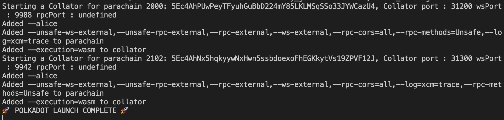
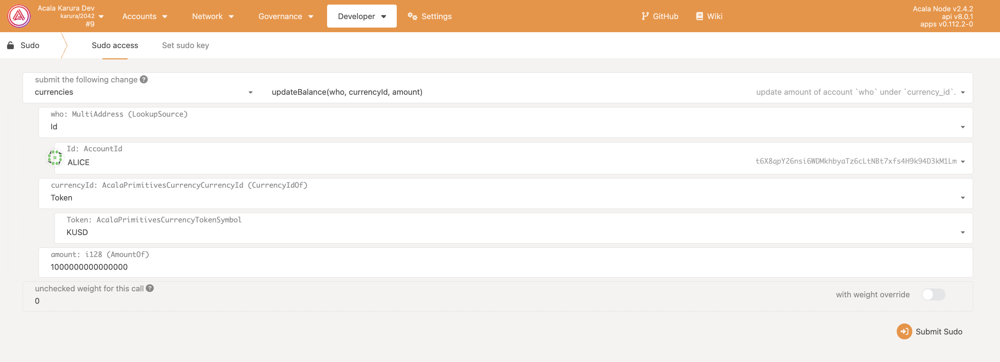
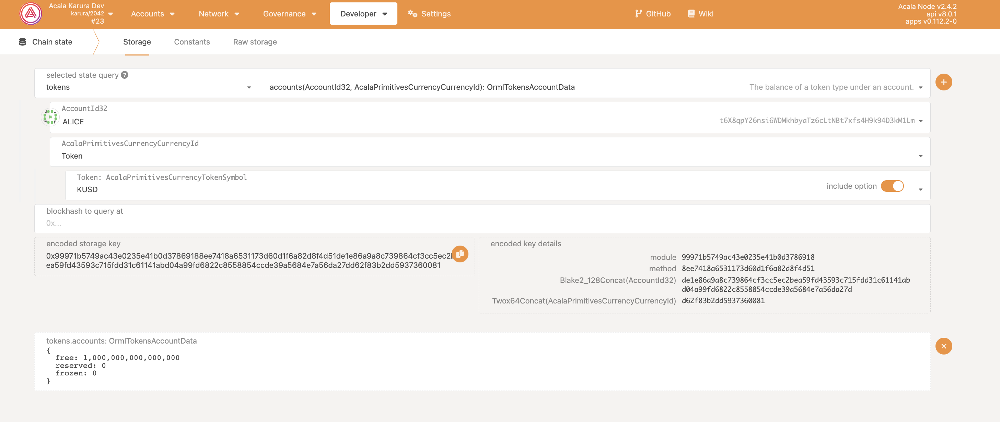
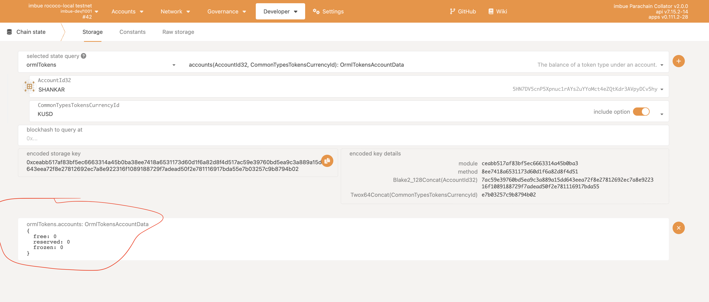
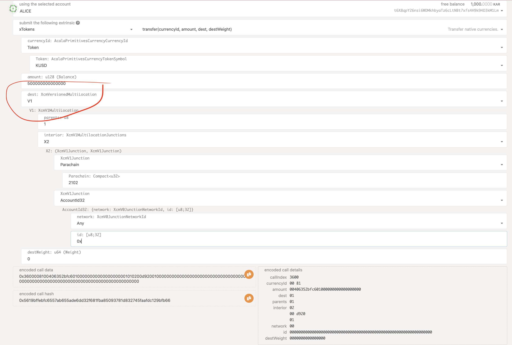
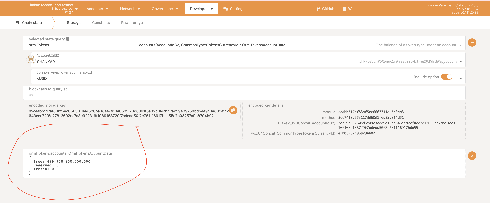

# Contributing with Stable(kUSD) for a project

This guide will show you step by step process to transfer the kusd from acala to our imbue chain via xcm and use that to contribute to a project. 

## Launch your relaychain(polkadot) and the parachains(acala and imbue) as shown below

### Build your binaries

- Checkout the imbue, acala and polkadot repositories and build the respective binaries:

  - imbue

    ```bash
    git clone --recursive https://github.com/ImbueNetwork/imbue.git
    cd imbue

    cargo build --release
    ```

  - polkadot

    ```bash
    git clone https://github.com/paritytech/polkadot.git

    cd polkadot
    cargo build --release
    ```

  - acala
  
      ```bash
    git clone https://github.com/AcalaNetwork/Acala.git

    cd Acala
      ```
    Follow their readme file to build and get binary

### Clone polkadot-launch repo

      ```bash
        git clone https://github.com/paritytech/polkadot-launch.git
        cd polkadot-launch
        yarn 
      ```

### Update the config.json file 

  - For this tutorial, i have used polkadot-launch to launch the relaychain and parachains. Update the config.json file inside the polkadot launch as shown below 

      ```javascript

      {
    "relaychain": {
      "bin": "./polkadot",
      "chain": "rococo-local",
      "nodes": [
        {
          "name": "alice",
          "wsPort": 9944,
          "port": 30444
        },
        {
          "name": "bob",
          "wsPort": 9955,
          "port": 30555
        },
        {
          "name": "charlie",
          "wsPort": 9966,
          "port": 30666
        },
        {
          "name": "dave",
          "wsPort": 9977,
          "port": 30777
        }
      ],
      "genesis": {
        "runtime": {
          "runtime_genesis_config": {
            "configuration": {
              "config": {
                "validation_upgrade_frequency": 1,
                "validation_upgrade_delay": 10
              }
            }
          }
        }
      }
    },
    "parachains": [
      {
        "bin": "./acala",
        "id": "2000",
        "chain": "karura-dev",
        "nodes": [
          {
            "wsPort": 9988,
            "port": 31200,
            "name": "alice",
            "flags": [
              "--unsafe-ws-external",
              "--unsafe-rpc-external",
              "--rpc-external",
              "--ws-external",
              "--rpc-cors=all",
              "--rpc-methods=Unsafe",
              "--log=xcm=trace",
              "--",
              "--execution=wasm"
            ]
          }
        ]
      },
      {
        "bin": "./imbue",
        "id": "2102",
        "nodes": [
          {
            "wsPort": 9942,
            "port": 31300,
            "name": "alice",
            "flags": [
              "--unsafe-ws-external",
              "--unsafe-rpc-external",
              "--rpc-external",
              "--ws-external",
              "--rpc-cors=all",
              "--log=xcm=trace",
              "--rpc-methods=Unsafe",
              "--",
              "--execution=wasm"
            ]
          }
        ]
      }
    ],
    "simpleParachains": [],
    "hrmpChannels": [
      {
        "sender": 2000,
        "recipient": 2102,
        "maxCapacity": 8,
        "maxMessageSize": 512
      },
      {
        "sender": 2102,
        "recipient": 2000,
        "maxCapacity": 8,
        "maxMessageSize": 512
      }
    ],
    "types": {},
    "finalization": false
       } 
       ```

   Make sure you update the path of your binaries, in my case i have copied the binaries into the polkadot-launch folder.

### Launch your chains

```bash
polkadot-launch ./config.json
```

Wait for few minutes until you see the message below in the terminal



### Mint kusd in Acala

Head over to https://polkadot.js.org/apps/ and switch to port 9988(for acala)

- Go to the sudo in the developer menu and choose the currencies pallet and call the extrinsic updateBalance as shown below.


Here we are minting 1000 kusd(additonal 12 zero for decimals)

- Now you can check the balance by going to the chain state in developer menu and selecting tokens and then accounts as shown below
  



### Tranferring kusd from Acala to Imbue Chain

- Before we can transfer lets check the balance of the kusd head over to another tab and go to polkadotjs, switch to port 9942. In imbue by go to chain state in developer menu as shown below 



You can see that there is zero kusd in imbue chain 

- Now set the transfer kusd from acala to imbue chain
  
   - In Imbue chain, updating the xcm version to 1 in imbue before it can receive kusd by xcm as shown below. Go to sudo and select polkadotxcm and call forceXCMVersion method.
   
   

   - In Acala chain, transfer kusd from acala to imbue chain by going to developer --> extrinsic and select the xTokens and call the method transfer. Make sure you copy the address from the imbue chain where you want to transfer kusd as shown below 
  

### Checking the kusd received in imbue chain

Head over to imbue chain in polakdotjs apps and select the chain state. Select ormltokens and call the method accounts. Click the '+' button in the right side and you should see the kusd received as shown below

  
    


